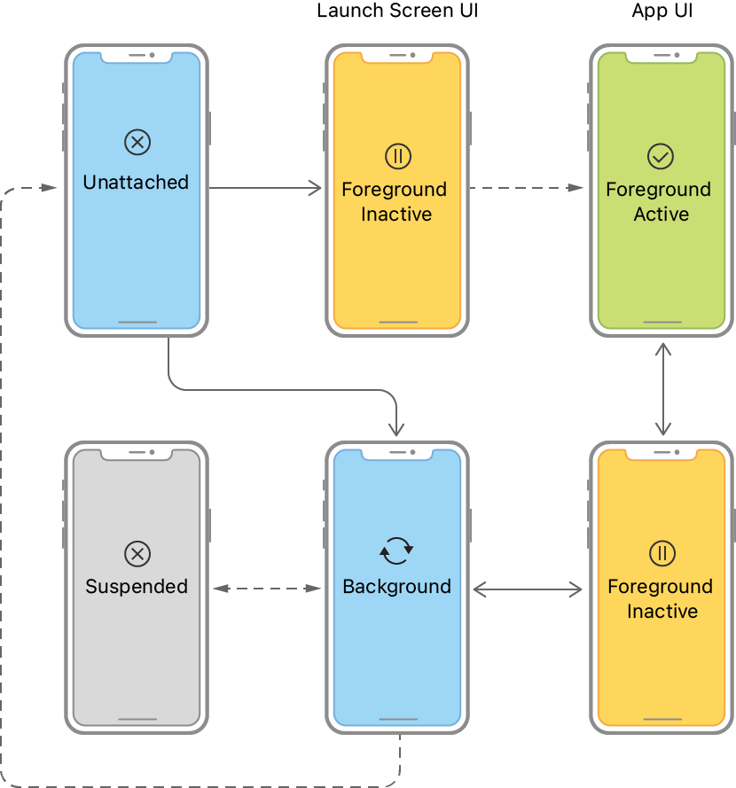
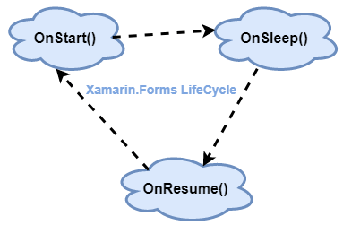
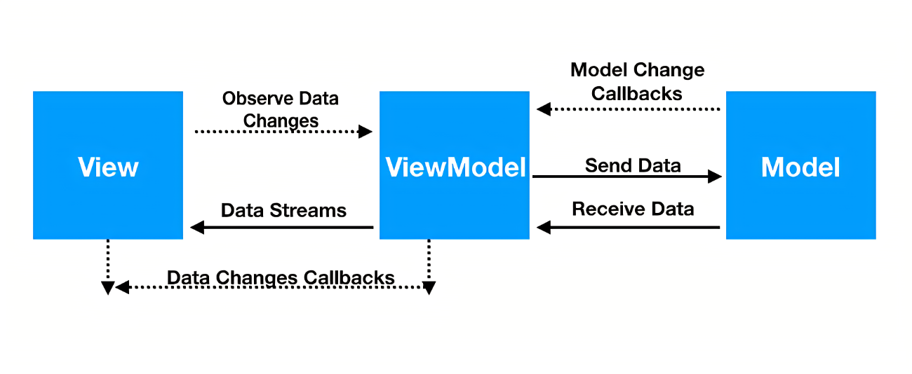

# Applications mobiles avec **Xamarin.Forms**

## Les approches du développement mobile :
- Applications développées avec les langages/technologies Java ou Kotlin pour Android ou Objective-C ou Swift pour iOS/iPadOS.
- Applications développées avec des frameworks Xamarin, Flutter, etc. qui traduisent le code source (C#, Dart, ...) dans un code natif à travers des brides (ponts).
- Applications développées avec une technologies front (HTML, React, ...), parfois accompagnées de wrappers (PhoneGap, ...).

## Les approches technologiques :

|Technologie|Code métier|Code UI|Android|iOS / iPadOS|
|--|--|--|--|--|
|Android|Java/Kotlin|AXML|✅|❌|
|iOS/iPadOS|Objective-C/Swift|XIB (Xcode Interface Builder, page par page) / **Storyboard (toutes les pages)**.|❌|✅|
|React Native|React (Typescript)|HTML, React, ...|✅|✅|
|PWA|JavaScript, Typescript, ReactJS, Angular, Blazor (C#), ...|HTML, technologie front (ReactJS, Angular, Blaozor, Razor, ...), ...|✅|✅|
|Flutter|Dart|Dart|✅|✅|
|Xamarin.Android|C#|AXML (natif Android)|✅|✅|
|Xamarin.iOS|C#|XIB, Storyboards (natif iOS)|✅|✅|
|Xamarin.Forms|C#|XAML (partagé)|✅|✅|

> Xamarin.Forms deviendra MAUI en novembre 2022.

Xamarin._X_ se base sur [Mono](https://www.mono-project.com) (et pas .NET Framework/.NET Core/.NET). C'est une implémentation de .NET (grâce au standard ECMA-335) sur les distributations Linux (Ubuntu, Xubuntu, DebianOS, OpenSuse, ...).

## Prérequis pour développer avec Xamarin
|Technologie|Installations Windows|Installations macOS|
|--|--|--|
|Xamarin.Android|SDK Android (pour les versions), JDK, Visual Studio avec les outils Xamarin, _Emulateurs_. |SDK Android (pour les versions), JDK, Visual Studio avec les outils Xamarin, _Emulateurs_.|
|Xamarin.iOS|Visual Studio avec les outils Xamarin, macOS avec XCode et les SDK's iOS (pour apparayer l'émulateur avec Windows et tester depuis cet OS) ou un compte Apple Developer.|XCode avec les SDK's et simulateurs iOS, Visual Studio, Xamarin.
|Xamarin.Forms|Les deux installations ci-dessus.|Les deux installations ci-dessus.|

> _En italique, les outils qui ne sont pas obligatoires._

# Android
- L'application doit avoir un fichier _manifest.xml_ qui va contenir les informations de l'application (versions d'Android compatibles, nom de l'application, thème, permissions, activités, ...) ;
- Les ressources sont stockées dans le dossier `R` et sont indéxées dans une classe pour être utilisées grâce à la méthode `view.findById(int)`.
- L'application se compose d'une ou plusieurs activités. Les activités ont un cycle de vie (`onCreate`, `onStart`, `onResume`, `onPause`, `onStop`, `onDestroy`, `onRestart`) ;
- L'activité de démarrage doit être présicée par la propriété de l'attribut (`MainLauncher`).


## Cycle de vie d'une activité Android


# iOS 
- Le point d'entrée de l'application est la classe `Application` et la méthode statique `Main(string[])`. La classe `UIApplication` permet de définir le nom de la classe principale, par défaut _AppDelegate_.
- L'`AppDelegate` permet de définir le comportement global de l'application iOS.
- On retrouve des ViewController qui vont gérer les interactions entre les différentes "pages".
- Les fichiers `*.storyboard` vont définir l'interface graphique de notre application iOS, y compris la navigation.
- Le fichier `info.plist` contient les informations relatives à mon application mobile : nom, périphériques, ...

## Cycle de vie d'une scène iOS


# Xamarin.Forms
- Framework qui permet de développer des applications mobiles (natives) sur Android et iOS  à l'aide des langages C# et XAML ; 
- Le point d'entrée est, par défaut, la classe `App` (fichier _`App.xaml.cs`_, qui hérite de `Xamarin.Forms.Application`) et défini la page de démarrage (Propriété `MainPage`) ; 
- Le fichier `App.xaml` contient les ressources (dictionnaires, thèmes, couleurs, ...) ; 
- Les fichiers `*.xaml.cs` sont le code _behind_ des pages `*.xaml` et sont liées à travers la propriété `x:Class` (côté xaml) ;
- On peut réutiliser toutes nos connaissances C# pour développer notre application (syntaxe, méthodes, packages NuGet, ...) ;

## Cycle de vie d'une application Xamarin.Forms


> Pour chaque événement, un lien est fait entre Xamarin.Forms et Xamarin.Android/Xamarin.iOS.

# Bindings
- Une liaison forte entre un élément et un autre (par exemple, entre un Label et un Slider).
- Différentes manières de créer une liaison (voir documentation officielle).

```xml
<ContentPage xmlns="http://xamarin.com/schemas/2014/forms"
             xmlns:x="http://schemas.microsoft.com/winfx/2009/xaml"
             x:Class="DataBindingDemos.AlternativeXamlBindingPage"
             Title="Alternative XAML Binding">
    <StackLayout Padding="10, 0">
        <Label Text="TEXT"
               FontSize="40"
               HorizontalOptions="Center"
               VerticalOptions="CenterAndExpand"
               Scale="{Binding Value, Source={x:Reference slider},
                               Path=Value}" />

        <Slider x:Name="slider"
                Minimum="-2"
                Maximum="2"
                VerticalOptions="CenterAndExpand" />
    </StackLayout>
</ContentPage>
```

> Informations complémentaires :
> - https://docs.microsoft.com/xamarin/xamarin-forms/enterprise-application-patterns/mvvm
> - http://wpftutorial.net/MVVM.html (comparaison des patterns MVVM-MVC-MVP)

# Data Templating
- Par défaut, une `ListView` permet d'afficher des éléments et n'a pas de template. Chaque élément aura pour contenu la valeur de la méthode `ToString()` (soit pour un `BlogPost` : `ExpertsBlog.Entities.BlogPost`) ;
- On peut personnaliser l'UI de chaque élément grâce à un DataTemplate ; 
- Le DataTemplate peut être défini à l'intérieur d'un `ItemTemplate` (exemple 1) ou dans les ressources d'une page (exemple 2) ou de l'application (fichier `App.xaml` - exemple 3).

### Exemple 1
```xml
<ContentPage ...>
<ContentPage.Resources>
    <!--Nothing, empty, nada, rien-->
</ContentPage.Resources>
<RefreshView>
    <CollectionView ItemsSource="{Binding Items}">
        <CollectionView.ItemTemplate>
            <!-- ItemTemplate ne peut prendre qu'un objet de type DataTemplate -->
            <DataTemplate>
                <StackLayout>
                    <Label Text="{Binding Title}"/>
                </StackLayout>
            </DataTemplate>
        </CollectionView.ItemTemplate>
    </CollectionView>
<RefreshView>
</ContentPage>
```

### Exemple 2
```xml
<ContentPage ...>
    <ContentPage.Resources>
        <DataTemplate x:Key="BlogPostTemplate">
            <StackLayout>
                <Label Text="{Binding Title}"/>
            </StackLayout>
        </DataTemplate>
    </ContentPage.Resources>
    <RefreshView>
        <CollectionView ItemsSource="{Binding Items}" ItemTemplate="{StaticResource BlogPostTemplate}"/>
    <RefreshView>
</ContentPage>
```
### Exemple 3
App.xaml :
```xml
<Application ...>
    <Application.Resources>
        ...
        <DataTemplate x:Key="BlogPostTemplate">
            <StackLayout>
                <Label Text="{Binding Title}"/>
            </StackLayout>
        </DataTemplate>
        ... 
    </Application.Resources>
</Application>
```
MainPage.xaml :
```xml
<ContentPage ...>
...
    <RefreshView>
        <CollectionView ItemsSource="{Binding Items}" ItemTemplate="{StaticResource BlogPostTemplate}"/>
    <RefreshView>
</ContentPage>
```

> Ne pas confondre l'utilité de `RefreshView`, `ListView` et `CollectionView`.

# Pattern MVVM

Plus ou moins équivalent au pattern MVC et MVP. Plus d'informations : http://wpftutorial.net/MVVM.html
## Rôles
- View : Afficher les données, retransmettre le ViewModel et envoyer les modifications à effectuer (un champs texte qui envoie une nouvelle valeur au ViewModel) ;
- ViewModel : Envoyer/Recevoir des données, transformer, notifier un changement à la _view_ (via l'implémentation de l'interface `System.ComponentModel.INotifyPropertyChanged`) ;
- Model : Les objets qu'on va manipuler pendant le cycle de vie de notre application _(DTO - Data Transfert Object)_.

## Exemple de code
```csharp
public class DemoViewModel : System.ComponentModel.INotifyPropertyChanged
{
    public event PropertyChangedEventHandler PropertyChanged;

    /// <summary>
    /// Méthode qui va effectuer la notification
    /// </summary>
    private void OnPropertyChanged(string propertyName)
    {
        // On vérifie que PropertyChanged n'est pas `null`
        if (PropertyChanged == null)
        {
            return;
        }
        // this = instance de `DemoViewModel`
        // Instancier l'événement qui va contenir le nom de la propriété à changer.
        // On créé les arguments de l'événement.
        var args = new PropertyChangedEventArgs(propertyName);
        // On invoque l'événément en lui donnant le nom de la propriété à modifier.
        PropertyChanged.Invoke(this, args);
    }

    /// <summary>
    /// Méthode générique qui va notifier le changement de valeur d'une propriété.
    /// </summary>
    /// <typeparam name="T">Type de la propriété publique et du champ privé.</typeparam>
    /// <param name="storage">Valeur avec sa réference (adresse en mémoire) du champ privé.</param>
    /// <param name="value">Nouvelle valeur.</param>
    /// <param name="propertyName">Le nom de la propriété qui va être modifiée.</param>
    protected void SetProperty<T>(ref T storage, T value, [CallerMemberName] string propertyName = null)
    {
        // Vérifier l'égalité entre la valeur de `storage` et de `value`.
        if (EqualityComparer<T>.Default.Equals(storage, value))
        {
            // Si la valeur est égale, on arrête.
            return;
        }
        // On remplace la valeur à l'adresse de `storage` par la nouvelle valeur, `value`.
        storage = value;
        // On appelle la méthode `OnPropertyChanged(string)` qui va créer un événement de changement de valeur.
        OnPropertyChanged(propertyName);
    }
}
```

> `INotifyCollectionChanged` permet d'être notifié si une collection a été mise à jour ou pas (ajout, édition, suppression, etc). Cette interface est implémentée dans `System.ObjectModel.ObservableCollection<T>`.

# Experts Blog
Une application de blogs spécialisée dans les commerces de proximité.

## Structure de la solution
|Projet|Description|
|--|--|
|`ExpertsBlog.Entities`|Les modèles (`BlogPost`, `Category`, `Tag`, ) qui serviront à notre API.|

## Création du projet
1. Créer un projet Xamarin.Forms (vide) nommé `ExpertsBlog`.
1. Implémenter le pattern MVVM.
1. Modifier la page d'accueil pour afficher une liste de `BlogPost`.
1. Modifier le `DataTemplate` de la liste à afficher.