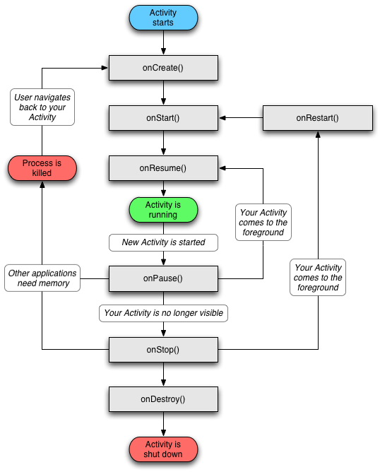

# Applications mobiles avec **Xamarin.Forms**

## Les approches du développement mobile :
- Applications développées avec les langages/technologies Java ou Kotlin pour Android ou Objective-C ou Swift pour iOS/iPadOS.
- Applications développées avec des frameworks Xamarin, Flutter, etc. qui traduisent le code source (C#, Dart, ...) dans un code natif à travers des brides (ponts).
- Applications développées avec une technologies front (HTML, React, ...), parfois accompagnées de wrappers (PhoneGap, ...).

## Les approches technologiques :

|Technologie|Code métier|Code UI|Android|iOS / iPadOS|
|--|--|--|--|--|
|Android|Java/Kotlin|AXML|✅|❌|
|iOS/iPadOS|Objective-C/Swift|XIB (Xcode Interface Builder, page par page) / **Storyboard (toutes les pages)**.|❌|✅|
|React Native|React (Typescript)|HTML, React, ...|✅|✅|
|PWA|JavaScript, Typescript, ReactJS, Angular, Blazor (C#), ...|HTML, technologie front (ReactJS, Angular, Blaozor, Razor, ...), ...|✅|✅|
|Flutter|Dart|Dart|✅|✅|
|Xamarin.Android|C#|AXML (natif Android)|✅|✅|
|Xamarin.iOS|C#|XIB, Storyboards (natif iOS)|✅|✅|
|Xamarin.Forms|C#|XAML (partagé)|✅|✅|

> Xamarin.Forms deviendra MAUI en novembre 2022.

Xamarin._X_ se base sur [Mono](https://www.mono-project.com) (et pas .NET Framework/.NET Core/.NET). C'est une implémentation de .NET (grâce au standard ECMA-335) sur les distributations Linux (Ubuntu, Xubuntu, DebianOS, OpenSuse, ...).

## Prérequis pour développer avec Xamarin
|Technologie|Installations Windows|Installations macOS|
|--|--|--|
|Xamarin.Android|SDK Android (pour les versions), JDK, Visual Studio avec les outils Xamarin, _Emulateurs_. |SDK Android (pour les versions), JDK, Visual Studio avec les outils Xamarin, _Emulateurs_.|
|Xamarin.iOS|Visual Studio avec les outils Xamarin, macOS avec XCode et les SDK's iOS (pour apparayer l'émulateur avec Windows et tester depuis cet OS) ou un compte Apple Developer.|XCode avec les SDK's et simulateurs iOS, Visual Studio, Xamarin.
|Xamarin.Forms|Les deux installations ci-dessus.|Les deux installations ci-dessus.|

> _En italique, les outils qui ne sont pas obligatoires._

# Android
- L'application doit avoir un fichier _manifest.xml_ qui va contenir les informations de l'application (versions d'Android compatibles, nom de l'application, thème, permissions, activités, ...) ;
- Les ressources sont stockées dans le dossier `R` et sont indéxées dans une classe pour être utilisées grâce à la méthode `view.findById(int)`.
- L'application se compose d'une ou plusieurs activités. Les activités ont un cycle de vie (`onCreate`, `onStart`, `onResume`, `onPause`, `onStop`, `onDestroy`, `onRestart`) ;
- L'activité de démarrage doit être présicée par la propriété de l'attribut (`MainLauncher`).

## Cycle de vie d'une activité Android

# iOS 
- Le point d'entrée de l'application est la classe `Application` et la méthode statique `Main(string[])`. La classe `UIApplication` permet de définir le nom de la classe principale, par défaut _AppDelegate_.
- L'`AppDelegate` permet de définir le comportement global de l'application iOS.
- On retrouve des ViewController qui vont gérer les interactions entre les différentes "pages".
- Les fichiers `*.storyboard` vont définir l'interface graphique de notre application iOS, y compris la navigation.
- Le fichier `info.plist` contient les informations relatives à mon application mobile : nom, périphériques, ...

## Cycle de vie d'une scène iOS

# Experts Blog
Une application de blogs spécialisée dans les commerces de proximité.

## Structure de la solution
|Projet|Description|
|--|--|
|`ExpertsBlog.Entities`|Les modèles (`BlogPost`, `Category`, `Tag`, ) qui serviront à notre API.|